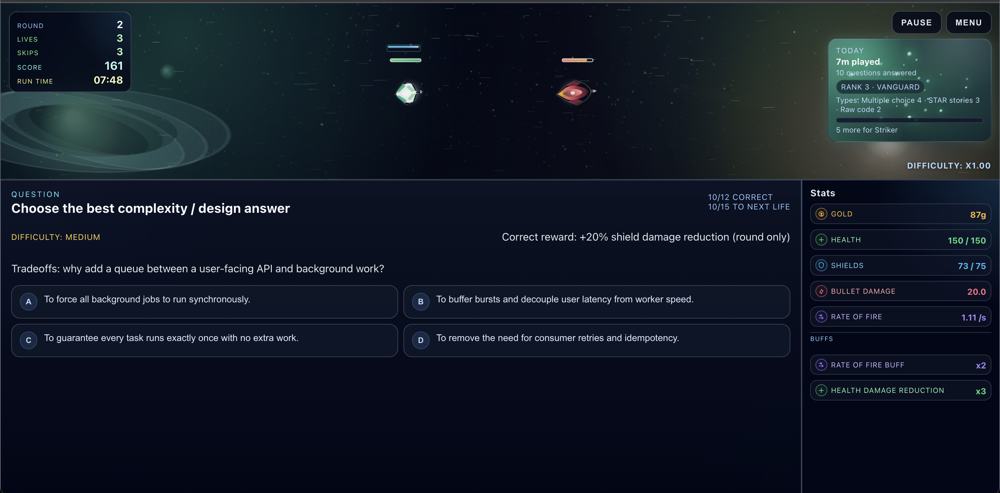

# Interview Prep Roguelite

A space-themed interview-prep game where each combat round is powered by technical and behavioral interview drills.



## What This Game Is

You pilot a run-based roguelite while answering interview questions under pressure.

- Correct answers improve your combat outcomes and run economy.
- Difficulty scales as your run progresses.
- You can train technical topics and behavioral recall in the same session.

Behavioral prep is supported through optional STAR story uploads, which turn your own stories into custom memorization drills.

## Quick Start

### Requirements

- Node.js 20+
- npm

### Run locally

From project root:

```bash
npm install
npm run dev
```

This starts both:

- Client (Vite)
- Server (Express + TSX watch)

## How To Play

1. Start a run.
2. During each question phase, choose the best answer (or complete the required interaction type).
3. Correct answers grant benefits (for example, survivability or offensive boosts).
4. Continue through rounds while managing lives, skips, and score.
5. Improve consistency by balancing speed with accuracy.

### Core run signals

- Left panel: round, lives, skips, score, run time.
- Center panel: current question and answer options.
- Right panel: combat stats and active buffs.

## Optional STAR Story Uploads

Before a run, you can open the STAR setup and upload files.

- Upload is optional: you can always start without STAR stories.
- Multiple files are supported.
- Accepted file types: `.txt`, `.md`, `.markdown`, `.text`, `.json`.
- The game can parse both explicit STAR format and plain narrative format.

If your files are not strict STAR, the game still creates usable sections automatically so drills can run.

## What STAR Stories Are

STAR is a structure for behavioral interview answers:

- Situation: context and constraints.
- Task: your responsibility or goal.
- Action: what you specifically did.
- Result: measurable impact and outcome.

A STAR story is a reusable, high-signal answer to prompts like:

- “Tell me about a time you handled an incident.”
- “Describe a tough tradeoff you made.”
- “Give an example of leadership without authority.”

## How To Write Strong STAR Stories

Use one story per file when possible.

### Recommended structure

```text
# Migrated Payments Safely
Situation: We had weekly checkout failures during peak traffic.
Task: I owned reducing payment error rate before holiday launch.
Action: I added request idempotency, queue-based retries, and a canary rollout with targeted alerts.
Result: Payment failures dropped 63%, and we shipped on schedule with no Sev-1 incidents.
```

### Writing tips

- Keep each section specific and concrete.
- Emphasize your actions, not only team actions.
- Include metrics (latency, error rate, revenue, conversion, time saved).
- Keep final spoken length to about 60 to 120 seconds per story.
- Prepare variants: short version, detailed version, deep-dive version.

## How To Present STAR Stories In Interviews

Use this delivery flow:

1. Start with context in one sentence.
2. State your responsibility clearly.
3. Spend most time on your decision-making and execution.
4. End with measurable outcomes and a brief reflection.

Presentation checklist:

- Lead with outcome when useful.
- Name tradeoffs and constraints.
- Explain why your approach was chosen.
- Keep language crisp and chronological.
- Close with what you learned and how you applied it later.

## How The Memorization System Helps You Retain STAR Stories

After upload, the game auto-generates practice from your own content.

### Drill types generated from your stories

- Story Match: map one section to the correct paired section from the same story.
- Story Title Match: identify which uploaded file/title a sentence came from.
- Section Ordering: reorder sentence snippets into original sequence.
- Full Story Timeline: reconstruct an entire story in exact order.
- Multi-Story Ordering (higher difficulty): separate and reorder combined story timelines.
- Story Transcription (voice/text recall):
  - Easy: full story visible while you recite.
  - Medium: first-sentence cues only.
  - Hard: no section text shown; recall from memory.

### Why this works for memory

The drills combine multiple recall modes:

- Recognition recall (matching/title questions).
- Sequencing recall (ordering).
- Free recall under pressure (transcription).
- Interference resistance (multi-story blends).

That mix improves retrieval strength and reduces blanking during real interviews.

### Practical memorization routine

1. Upload 4 to 8 stories tied to roles you are targeting.
2. Run daily short sessions (15 to 25 minutes).
3. Track where you miss: section transitions, metrics, or chronology.
4. Rewrite weak sections in source files and re-upload.
5. Repeat until hard-mode recall is stable and fluent.

## STAR File Authoring Notes

The parser recognizes common STAR heading variants such as:

- Situation / Context / Background
- Task / Goal / Responsibility / Objective
- Action / Actions / Approach / What I did
- Result / Results / Outcome / Impact

So you can keep your natural writing style and still get good drill generation.

## Build

```bash
npm run build
```

## Project Layout

- `client/`: React + Vite frontend and gameplay/question systems.
- `server/`: Express backend used during local development.
